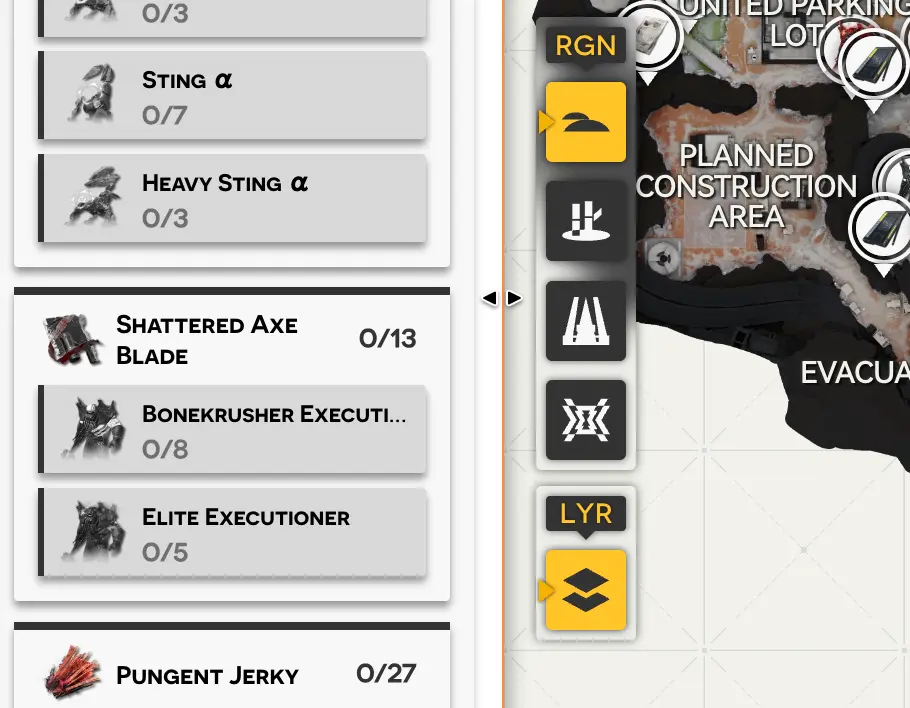
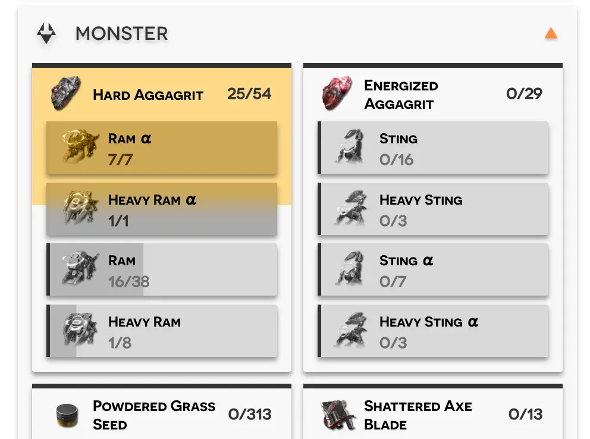
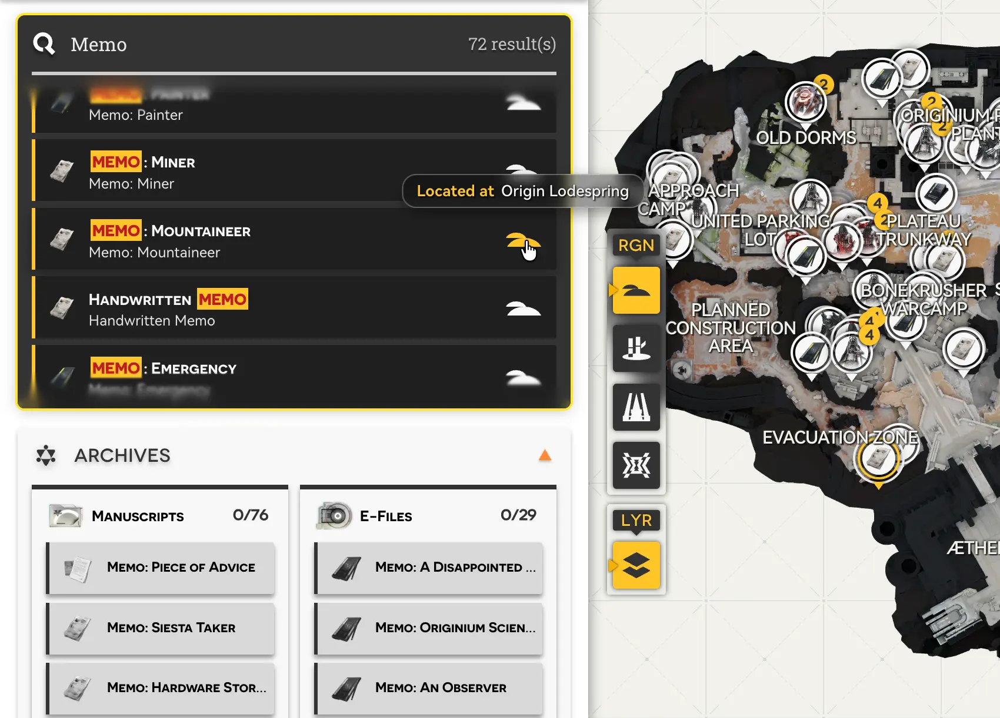
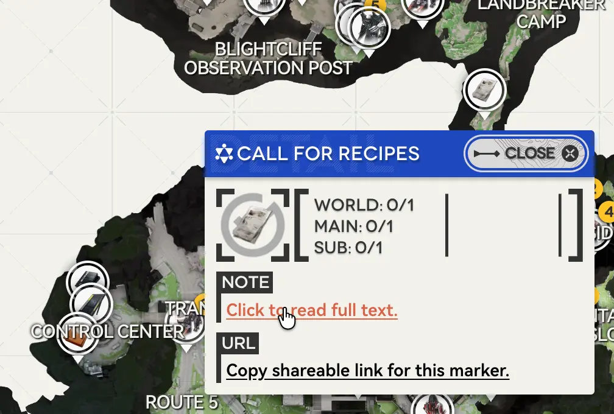

OEM을 사용하고 응원해 주셔서 감사합니다.

1.1 버전 업데이트 이후 OEM 개발팀은 **Open Endfield Map**을 가장 편리한 엔드필드 지도 도구로 만들기 위해 신규 기능 개발에 집중해 왔습니다. 이번에는 **지도 데이터와 사용 방식**에 관한 중요한 기능 업데이트를 소개합니다. 아래 내용을 확인하면 사용 경험이 더 좋아질 수 있습니다.

## 사이드바 및 필터 업데이트
포인트 수와 검색 조건이 점점 복잡해짐에 따라, 사이드바 너비를 조절할 수 있는 기능을 추가했습니다. 사이드바 오른쪽 경계를 드래그해 너비를 변경할 수 있습니다(**그림 1**).

*그림 1: 사이드바 오른쪽 경계를 드래그하면 너비를 조절할 수 있습니다.*

- 사이드바를 넓히면 필터가 3열 레이아웃으로 전환됩니다.
- "적"과 "아카이브"처럼 드롭 아이템 등 다차원 속성이 있는 포인트에는 분류 선택기(**그림 2**)를 추가했습니다. 같은 속성의 필터를 묶어 표시해 빠르게 선택할 수 있습니다.

*그림 2: 분류 선택기로 같은 속성의 필터 그룹을 빠르게 전환할 수 있습니다.*

향후 업데이트에서는 집계 방식을 직접 바꾸는 기능도 제공할 예정이며, 적 세력/등급 기준으로도 필터링할 수 있게 됩니다.

---

## 신규 아카이브 데이터셋
신중한 데이터 수집과 정제를 거쳐, OEM에 게임 내 "아카이브 라이브러리"에서 지도상 수집 가능한 모든 포인트를 추가했습니다. 또한 특정 아카이브 단일 항목을 독립적으로 검색할 수 있습니다.

기존의 여러 지도(공식 지도 포함)는 아카이브 포인트를 큰 한 분류로만 표시해 수집 보완이 불편했습니다. 하지만 실제로는 특정 아카이브를 찾아 채워야 하는 경우가 많습니다. OEM은 이 부분을 더 편리하게 해결합니다.

- 수집 가능한 모든 아카이브가 이제 사이드바에 개별 항목으로 표시됩니다.
- 위에서 언급한 **분류 선택기**를 통해 "종이 기록", "전자 문서" 등 게임 내 분류와 속성을 일치시켜 손쉽게 누락 포인트를 찾을 수 있습니다.
- 전역 검색 시스템과 통합되어 아카이브 **제목 또는 본문**으로 포인트를 직접 찾을 수 있습니다(**그림 3**).
- 포인트 상세에서 **전체 내용 보기**를 눌러 지도를 벗어나지 않고 아카이브를 읽을 수 있습니다(**그림 4**).

*그림 3: 제목 또는 본문 키워드로 아카이브와 포인트를 검색합니다.*

*그림 4: 포인트 상세에서 아카이브 전체 내용을 바로 확인하고 링크로 공유할 수 있습니다.*

---

## 전역 검색 시스템
**그림 3**과 같이 검색 기능이 업데이트되었습니다.

- **모든 아카이브와 포인트 내용**을 빠르게 검색할 수 있으며, 결과에는 본문 요약과 분포 정보가 포함됩니다.
- 유형 검색 결과를 클릭하면 해당 필터를 클릭한 것과 동일하게 동작하여 해당 유형이 선택됩니다.
- 고유 포인트 검색 결과는 클릭 시 **해당 포인트로 즉시 이동**합니다.

---

## 딥링크 및 포인트 공유
**그림 4**와 같이:

- 이제 모든 포인트에서 **공유 링크 복사**를 지원합니다.
- 친구에게 공유하거나 **북마크**로 저장할 수 있으며, 공유 링크를 열면 해당 포인트로 바로 이동하고 애니메이션으로 강조 표시됩니다.

---

사용 중 궁금한 점이나 프로젝트 관련 의견이 있다면 아래로 연락해 주세요.

* **프로젝트 QQ 그룹**: [Join Endfield Map Discussion](https://qm.qq.com/q/OQbocvQzCO)
* **Discord 플레이어 커뮤니티**: [Join Endfield Surveying Institute](https://discord.gg/BFMAKZSUG7)
* **지원/컴플라이언스 메일**: [support@opendfieldmap.org](mailto:support@opendfieldmap.org)
* **오픈소스 저장소**: [Atlos on GitHub](https://github.com/Terra-Online/Atlos)
