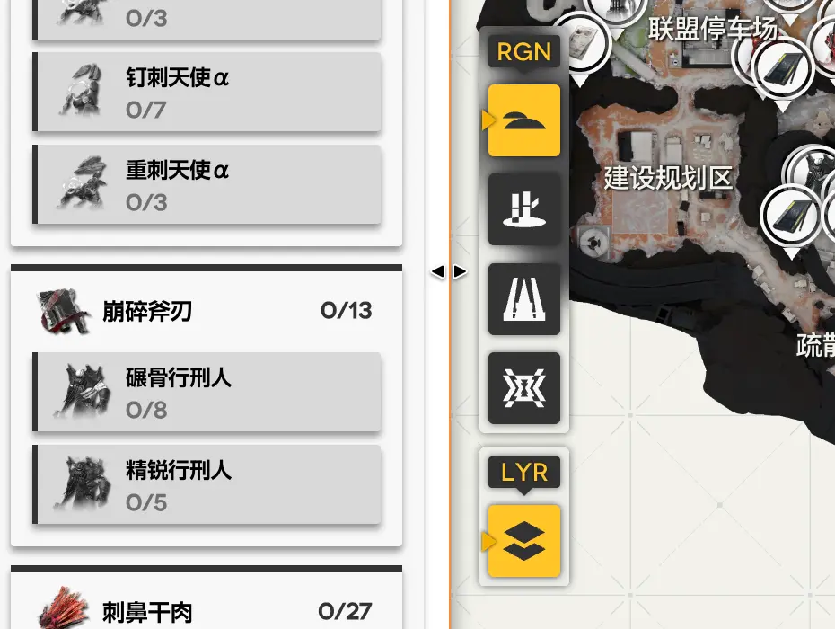
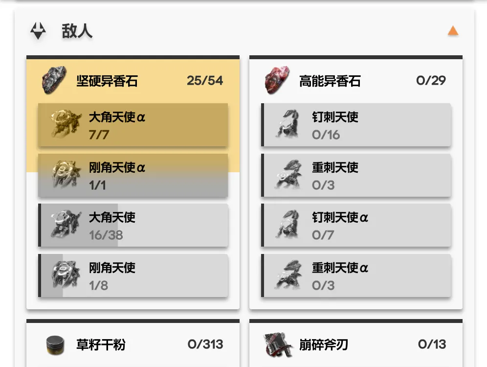
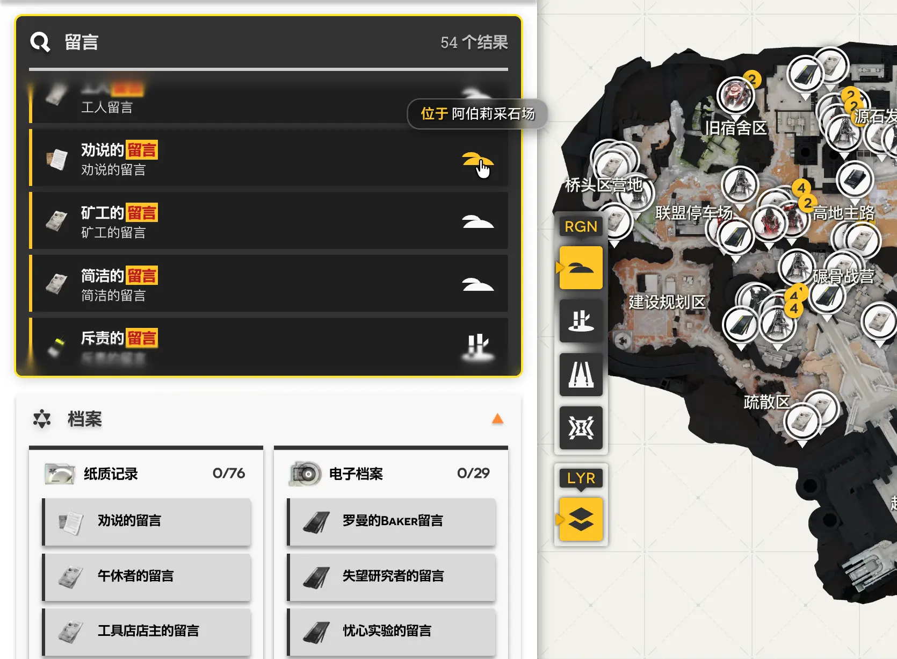
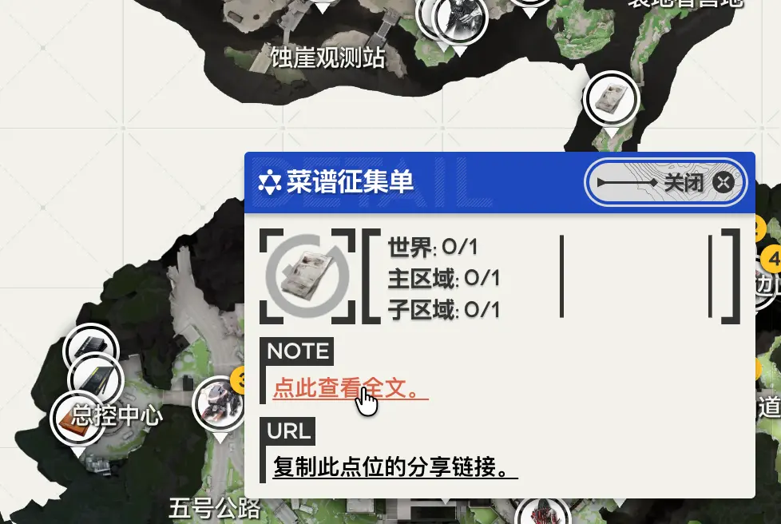

感谢各位对OEM的使用与支持。

自1.1版本更新以来，OEM开发团队一直专注于新功能的开发，致力于让 **Open Endfield Map** 成为最好用的终末地地图工具。我们很高兴为各位带来一次关于**地图数据和使用方法**的重大功能更新；阅读以下介绍内容可能改善您的使用体验，请见下文：

## 侧边栏与筛选器更新
随着点位的增多和检索条件的复杂化，我们为侧边栏新增了可变宽度的功能，您可以通过拖曳侧边栏右侧调整其宽度（**图1**）；

*图1：拖曳侧边栏右侧边缘即可调整宽度。*

- 在更宽侧边栏中，筛选器会变为三列布局；
- 对于「敌人」和「档案」这类具有类似掉落物等多维属性的点位，我们为其新增了一个分类选择器（**图2**），将具有一致属性的筛选器聚合显示，您便可以快捷地选中同类的点位。

*图2：通过分类选择器快速切换同属性筛选项。*

在未来更新中，我们还会推出更改聚合方式的功能，您届时也可以根据敌人阵营/等阶来筛选。

---

## 新增档案数据集
经过审慎的数据采集与清洗，我们为OEM添加了游戏内「档案库」中所有可在地图上收集的点位，并提供了单独检索任何单一档案的能力。
现有的几个地图（包括官方地图）仅将档案点位折叠为一大类进行展示，然而在大部分场景中，用户需要查找特定档案进行补全，目前 OEM 提供了最方便的解决方案：
- 所有可收集档案现在都在侧边栏中单独列出。  
- 通过上文提及的**分类选择器**，档案的属性现已与游戏内档案库的「纸质记录」「电子档案」等完全对齐，方便您分类检索缺失点位；
- 整合全局搜索系统，您可以通过档案的**标题或正文**直接检索点位（**图3**）。
- 可在点位详情直接点击**查看完整内容**阅读档案信息，无需离开地图（**图4**）。 

*图3：按标题或正文关键字检索档案与点位。*

*图4：在点位详情中直接查看档案全文，并支持分享跳转。*

---

## 全局搜索系统
如**图3**所示，搜索功能已经引来更新。
- 快速查找**任意档案与点位内容**，搜索结果包含正文摘要以及点位分布情况；
- 对于类型搜索结果，点击搜索结果等效于点击对应的筛选器，会选择此类点；  
- 对于唯一点位的搜索结果，点击即可 **跳转对应点位**。

---

## 深链接与点位分享
如**图4**所示：
- 当前，每个点位都支持 **复制分享链接**。  
- 可发送给好友或用作 **书签收藏**，随时返回查看，使用分享链接会直接导航至对应点，并以动画提示。

---

如在使用过程中有任何疑问，或对本项目有任何意见和建议，请通过以下方式联系我们：

* **项目 QQ 群组**：[加入 终末地大地图交流](https://qm.qq.com/q/OQbocvQzCO)
* **Discord 玩家社区**：[加入 Endfield Surveying Institute](https://discord.gg/BFMAKZSUG7)
* **支持团队邮箱**：[support@opendfieldmap.org](mailto:support@opendfieldmap.org)
* **代码仓库**：[Atlos on GitHub](https://github.com/Terra-Online/Atlos)
* **Bluesky 账户**：[追蹤 Open Endfield Map](https://bsky.app/profile/opendfieldmap.bsky.social)